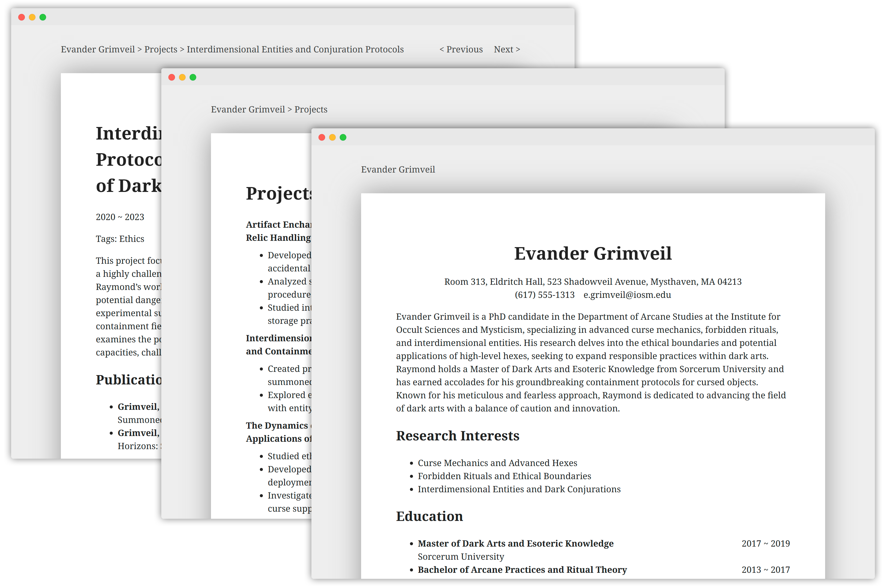

# Hugo Theme: Live CV

*Live CV* is a Hugo theme designed for building academic-style online curriculum vitae.

## Demo

View a live demo of the theme (built using the exampleSite as the source and featuring a fictional character Evander Grimveil) hosted on [GitHub Pages](https://clusravin.github.io/hugo-theme-live-cv).



## Features

- **Academic Styling**: Clean, professional design optimized for academic CVs.
- **Custom Project Profiles**:
  - Flexible date fields for start and end dates.
  - Option to link projects with related publications.
- **Easy Publication Management**:
  - Automatic author name highlighting.
  - Support for defining representative publications.
- **Responsive Design**: 
  - Adaptive layout for various screen sizes.
  - Automatic light/dark mode based on system preferences.

## Installation

To install *Live CV*, run the following commands in the root directory of your Hugo site:

```bash
cd themes
git clone https://github.com/Clusravin/hugo-theme-live-cv.git
```

## Configuration

Site configurations are defined in the main Hugo configuration file (e.g., `hugo.toml`). For an example, refer to [exampleSite/hugo.toml](https://github.com/Clusravin/hugo-theme-live-cv/blob/main/exampleSite/hugo.toml).